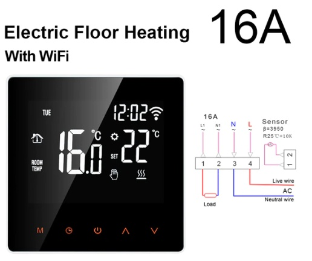
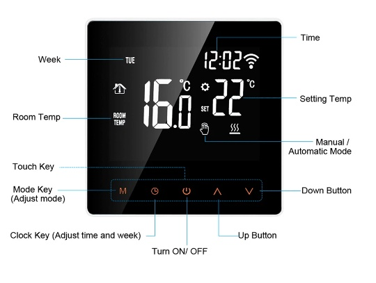
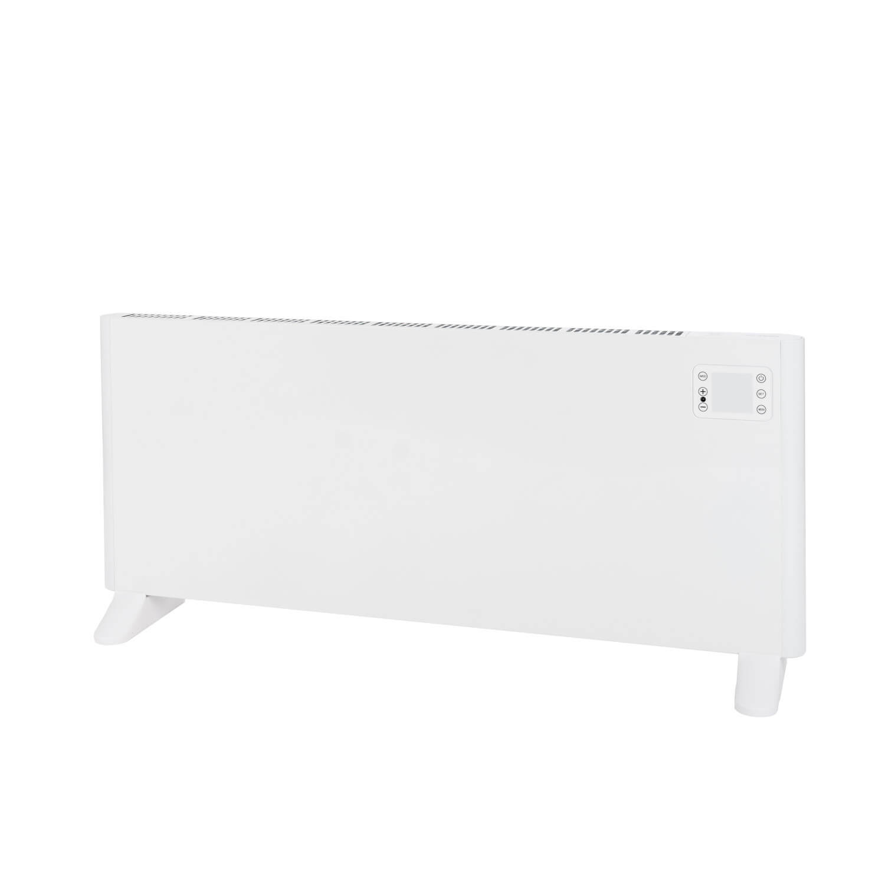
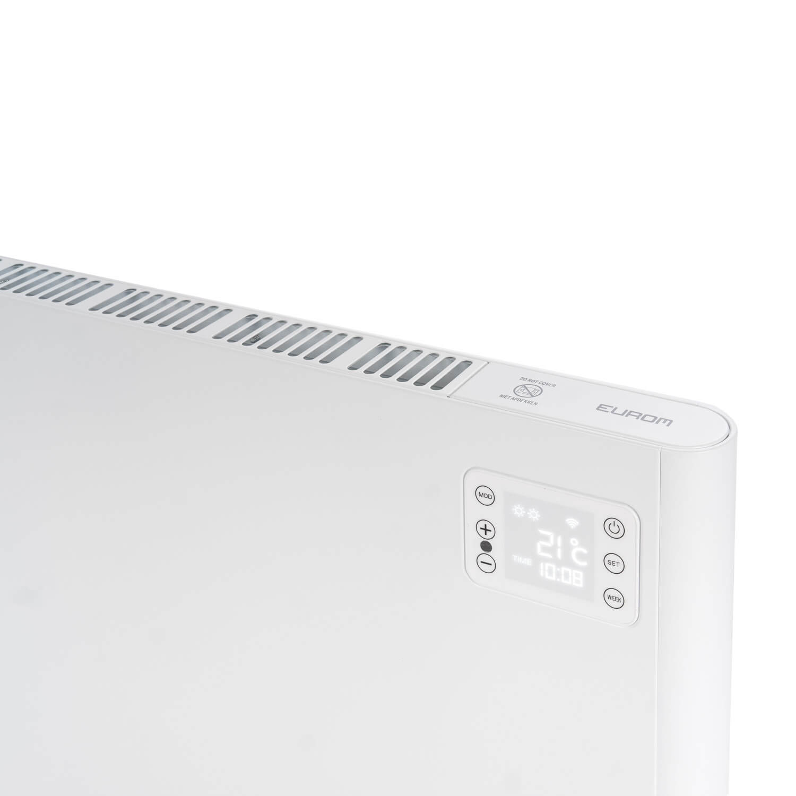

# tuya-playground

Python code to play with the Eurom heater and Avatto thermostat with Tuya integration

Copy file local_sample.settings.json to local_sample.settings.json and fill in the "secrets"

To install the dependencies:

```command
pip install -r requirements.txt
```

## Avatto thermostat

J-WT81-16A, ME81H, WIFIF, 16A

- [Avatto Manual](media/Avatto_M81AH_manual.pdf)





## Eurom heater

- [Alutherm 2500 Wifi](https://eurom.nl/en/product/permanent-heating/convectors-permanent/alutherm-2500-wifi/)
- [Alutherm Manual](media/Alutherm-1000_1500_2000_2500-Wifi-v7.0.pdf)





## Credits

- [GitHub - jasonacox/tinytuya](https://github.com/jasonacox/tinytuya)
- [GitHub - rospogrigio/localtuya](https://github.com/rospogrigio/localtuya)
- [GitHub - clach04/python-tuya](https://github.com/clach04/python-tuya)
- [Find Tuya Data Points](https://www.zigbee2mqtt.io/advanced/support-new-devices/03_find_tuya_data_points.html)
- [YouTube - Local Control of Tuya Devices // No Cloud Needed // LocalTuya](https://www.youtube.com/watch?v=VCd0kYWLvMQ&ab_channel=ThisSmartHouse)
- [YouTube - Adding Local Tuya Devices (Dekala Arkenstone Lamp)](https://www.youtube.com/watch?v=eOtslB2ilf0&ab_channel=SlackerLabs)
- [Tuya Heater using Tasmota and Home Assistant Climate Entities](https://blakadder.com/tuya-climate/)
- [GitHub - TuyaAPI/cli](https://github.com/TuyaAPI/cli)
- [Develop Tuya-Compatible Home Assistant Drivers](https://medium.com/@ekfz.t/develop-tuya-compatible-home-assistant-drivers-f74ac6e2e08c)
- [GitHub - tuya/tuya-home-assistant](https://github.com/tuya/tuya-home-assistant)
- [GitHub - tuya/tuya-iot-python-sdk](https://github.com/tuya/tuya-iot-python-sdk)
- [Home Assistant - Tuya](https://www.home-assistant.io/integrations/tuya/)
